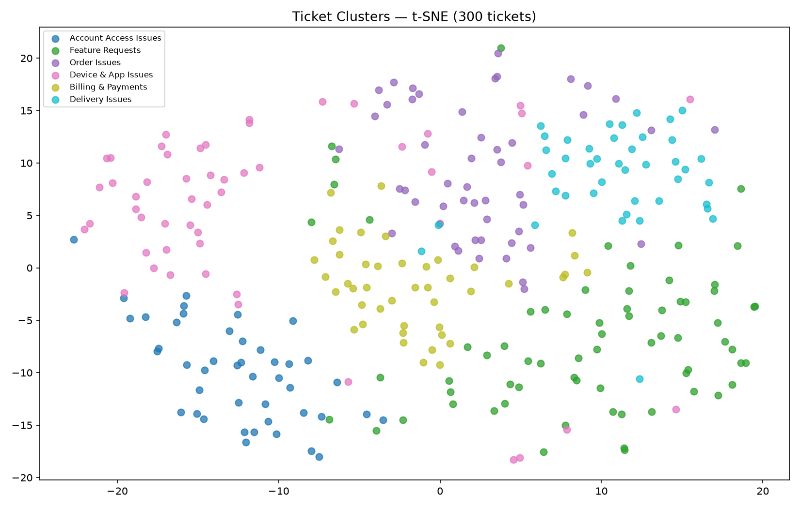

# Результати: Автокатегоризація тікетів через Embeddings (HW v2)

> Заповніть цей файл після виконання домашнього завдання.

---

## 1. Кластеризація

**Датасет:** 300 synthetic support tickets (labeled — `category` field used for ARI ground truth)

**Embedding модель:** all-MiniLM-L6-v2

### Пошук оптимального k

Запустіть `uv run starter.py --quick --clusters N` для кожного значення і запишіть ARI:

| k  | ARI score |
|----|-----------|
| 3  | _____     |
| 4  | _____     |
| 5  | _____     |
| 6  | _____     |
| 7  | _____     |
| 8  | _____     |
| 9  | _____     |
| 10 | _____     |
| 12 | _____     |

**Оптимальне k:** _____ — **ARI:** _____

**Чому саме це k?** *(1–2 речення)*

### Візуалізація t-SNE

<!-- Перетягніть clusters.png або вставте скріншот -->

### Таблиця кластерів

| # | Назва від LLM | К-ть тікетів |
|---|---------------|-------------|
| 0 | _____         | _____       |
| 1 | _____         | _____       |
| 2 | _____         | _____       |
| 3 | _____         | _____       |
| 4 | _____         | _____       |
| 5 | _____         | _____       |

*(Додайте або приберіть рядки відповідно до обраного k)*

---

## 2. Порівняння методів пошуку

Скопіюйте результати з консолі для кожного з 5 демо-запитів.

### Запит 1: `"my laptop screen is broken"` → очікувана категорія: `technical`

| Метод             | Час (ms) | Топ-1 результат (коротко)   | Recall 3/5 (≥3 з top-5 правильна категорія?) |
|-------------------|----------|-----------------------------|-----------------------------------------------|
| BM25              | _____    | _____                       | так / ні                                      |
| Cosine numpy      | _____    | _____                       | так / ні                                      |
| Fusion RRF        | _____    | _____                       | так / ні                                      |
| Qdrant :memory:   | _____    | _____                       | так / ні                                      |

### Запит 2: `"I can't authenticate my identity"` → очікувана категорія: `account`

| Метод             | Час (ms) | Топ-1 результат (коротко)   | Recall 3/5 |
|-------------------|----------|-----------------------------|------------|
| BM25              | _____    | _____                       | так / ні   |
| Cosine numpy      | _____    | _____                       | так / ні   |
| Fusion RRF        | _____    | _____                       | так / ні   |
| Qdrant :memory:   | _____    | _____                       | так / ні   |

### Запит 3: `"money problems with my purchase"` → очікувана категорія: `billing`

| Метод             | Час (ms) | Топ-1 результат (коротко)   | Recall 3/5 |
|-------------------|----------|-----------------------------|------------|
| BM25              | _____    | _____                       | так / ні   |
| Cosine numpy      | _____    | _____                       | так / ні   |
| Fusion RRF        | _____    | _____                       | так / ні   |
| Qdrant :memory:   | _____    | _____                       | так / ні   |

### Запит 4: `"package not delivered to my address"` → очікувана категорія: `shipping`

| Метод             | Час (ms) | Топ-1 результат (коротко)   | Recall 3/5 |
|-------------------|----------|-----------------------------|------------|
| BM25              | _____    | _____                       | так / ні   |
| Cosine numpy      | _____    | _____                       | так / ні   |
| Fusion RRF        | _____    | _____                       | так / ні   |
| Qdrant :memory:   | _____    | _____                       | так / ні   |

### Запит 5: `"want to send the item back for a refund"` → очікувана категорія: `returns`

| Метод             | Час (ms) | Топ-1 результат (коротко)   | Recall 3/5 |
|-------------------|----------|-----------------------------|------------|
| BM25              | _____    | _____                       | так / ні   |
| Cosine numpy      | _____    | _____                       | так / ні   |
| Fusion RRF        | _____    | _____                       | так / ні   |
| Qdrant :memory:   | _____    | _____                       | так / ні   |

### Приклад: Ticket Helper

*(Ticket Helper використовує **останній** демо-запит. У `--quick` режимі кластери називаються "Cluster 0", "Cluster 1" тощо — для LLM-назв запустіть без `--quick`.)*

**Новий тікет:** "_____"

**Підказана категорія (majority top-3):** _____

**Найближча назва кластера (k-means + LLM):** _____

**Подібні звернення:**
1. _____
2. _____
3. _____

---

## 3. Latency-Quality Frontier

Заповніть середні значення по 5 запитах. Cosine numpy — навчальний baseline, він показує що Qdrant робить ту саму математику; в production його не використовують.

Значення виводяться автоматично в кінці скрипта — рядок **"Summary — avg over all demo queries"**. Скопіюйте звідти:

| Метод                          | Avg recall@5 | Avg latency (ms) | Production-ready? |
|--------------------------------|--------------|------------------|-------------------|
| BM25 keyword                   | ___ / 5      | ___ ms           | ✓ (для keyword)   |
| Cosine numpy *(baseline)*      | ___ / 5      | ___ ms           | ✗ O(n), не масштабується |
| Qdrant :memory: *(TODO 5)*     | ___ / 5      | ___ ms           | ✓ (vector DB)     |

**Qdrant vs Cosine numpy overlap:** ___/5 (має бути 5/5 — вони роблять одне і те саме)

*(Бонус reranker — окремо в секції 5)*

**Висновок:** Який метод дав найвищий recall? Яке рішення обрали б для production helpdesk де точність важливіша за latency? Чому cosine numpy не підходить для прод, навіть якщо зараз він швидший за Qdrant?

_(3–4 речення)_

---

## 4. Висновки

**1.** Які типи запитів краще знаходить BM25? Які — cosine? Наведіть конкретний приклад із запитів 2 або 5.

**2.** Порівняйте Qdrant :memory: і cosine numpy за точністю — overlap вивів скрипт. Що ви побачили? Чому результати майже ідентичні?

**3.** Проаналізуйте ARI-таблицю з секції 1. При якому k ARI досягає піку? Що відбувається з кластерами при k нижче і вище оптимального?

**4.** Fusion RRF: чи вплинув він на топ-1 порівняно з окремими методами? При якому із запитів найбільша різниця?

**5.** Що таке latency-quality tradeoff у пошуку? Де на вашій таблиці знаходиться Pareto frontier?

---

## 5. Бонус: Reranker порівняння

Запустіть: `uv run starter.py --rerank --query "I can't log into my account"`

| Модель              | Топ-1 результат (коротко) | Precision@1 (топ-1 правильна категорія?) | Latency (ms) |
|---------------------|---------------------------|------------------------------------------|--------------|
| ms-marco-MiniLM     | _____                     | так / ні                                 | ___ ms       |
| bge-reranker-base   | _____                     | так / ні                                 | ___ ms       |
| bge-reranker-v2-m3  | _____                     | так / ні                                 | ___ ms       |

**Яка модель дала найкращий результат?**

**Чому ms-marco програє на коротких support-ticket текстах?** _(підказка: на яких даних вона тренувалась?)_

_(2–3 речення)_

---

## 6. Бонус: свій запит

Придумайте запит і запустіть: `uv run starter.py --query "ваш запит"`

**Ваш запит:** "_____"

| Метод           | Топ-1 результат (коротко) | Overlap з Cosine |
|-----------------|---------------------------|-----------------|
| BM25            | _____                     | ___ / 5         |
| Cosine numpy    | _____                     | —               |
| Qdrant :memory: | _____                     | ___ / 5         |

Чому BM25 і cosine дали саме такі результати? _(2–3 речення)_
