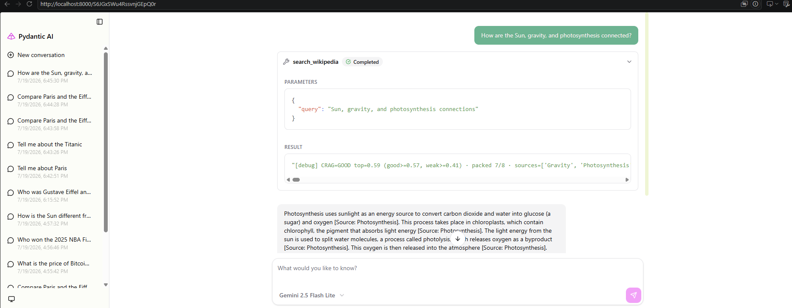

# Результати: Wikipedia RAG Pipeline v3

> Заповніть після виконання. Головна ідея — **довести числом**, що кожне покращення справді допомогло (а не просто ускладнило). Запускайте `uv run eval/eval.py --ablation`.

## Скріншот чату



---

## 1. Retrieval-якість: chunk-size sweep (вимірюється)

Скопіюйте числа прямо з таблиці, яку друкує `uv run eval/eval.py --ablation`.

| chunk_size | recall (single) | recall (multi) | precision@k |  MRR  | refusal_acc | retrieval ms | index build ms | # chunks |
|:----------:|:---------------:|:--------------:|:-----------:|:-----:|:-----------:|:------------:|:--------------:|:--------:|
|    200     |      0.917      |     0.833      |    0.688    | 0.917 |    0.667    |    30.16     |    63769.4     |  28235   |
|    400     |      1.000      |     0.806      |    0.615    | 0.885 |    0.667    |    17.64     |    51510.4     |  12336   |
|    700     |      0.917      |     0.917      |    0.552    | 0.875 |    1.0      |    11.97     |    48320.9     |   7150   |

> `recall (multi)` — це **RAW-retrieval** без decomposition (один вектор на весь multi-hop запит), тому він **нижчий** за single — це і є мотивація для query decomposition (fan-out у чат-пайплайні, bonus).

**Який розмір виграв і чому? Порівняйте recall (single) vs recall (multi) vs precision vs latency — де компроміс?**

recall (single) - 400 is the winner. This is about 400 chars (~70 words) plus overlap. It has enough context to find the right document, but it is not so big that other meanings from the text pollute the embedding. So it fits our embedding model best.

recall (multi) - 700 is the winner. A bigger chunk holds more parts of a multi-hop answer in one vector, so the right text is found more often. This is better coverage, not better precision.

precision - 200 is the winner. A smaller chunk is more focused on one topic, so the results are cleaner - less useless text in each chunk we find.

latency - 700 is the winner. Fewer chunks means less latency. On a bigger scale we can make it even faster with ANN search.

The compromise: small chunks give better precision, but they cost more. They are slower (30 ms), they make about 4x more chunks (28235 vs 7150), and the index build is slower (63.8 s vs 48.3 s). Big chunks are faster and cover multi-hop better, but precision drops (0.552). So we trade precision and memory for speed and coverage.

With this dataset of chunk sizes overall winner is 400. It gives the best recall (single) = 1.000, the latency is much better than 200 (17.6 vs 30.2 ms), and the index is half the size. Its only weak point is the lowest recall (multi) (0.806), but query decomposition (bonus) should fix this: for multi-hop we do not use one vector, we split the question. But this was only the first 3-size test - after the full sweep below I changed the choice to 700/60.


Chunk size / overlap research

config       rec(single)  rec(multi)   prec@k    mrr  refusal   ret_ms  n_chunks
--------------------------------------------------------------------------------
200/0                1.0       0.917    0.615  0.887    0.667    24.98     20197
200/40             0.917       0.722    0.677  0.917    0.667    29.64     24870
200/60             0.917       0.833    0.688  0.917    0.667    36.88     28235
200/100              1.0       0.778    0.719  0.872    0.667    46.65     39060
300/0                1.0       0.917    0.594  0.885    0.667     18.4     13822
300/40             0.917       0.917    0.615  0.917    0.667    21.11     15761
300/60             0.917       0.806    0.635  0.875    0.667     22.4     17006
300/100            0.917       0.833    0.646  0.875    0.667    25.15     20197
400/0              0.917       0.861    0.583  0.847    0.667    16.13     10668
400/40               1.0       0.861    0.604  0.887    0.667     21.1     11714
400/60               1.0       0.806    0.615  0.885    0.667    17.14     12336
400/100            0.917       0.861    0.604  0.819    0.667    19.53     13822
500/0              0.917       0.861    0.552  0.875    0.667    13.87      8743
500/40               1.0       0.861    0.573  0.831    0.667    13.89      9408
500/60             0.917       0.861    0.552  0.833    0.667    14.99      9814
500/100            0.917       0.861    0.625  0.819    0.667    15.95     10668
700/0              0.917       0.917     0.51  0.833    0.667    11.07      6620
700/40               1.0       0.917    0.552  0.829    0.667    12.23      6963
700/60             0.917       0.917    0.552  0.875    0.667    12.98      7150
700/100              1.0       0.861    0.552   0.79    0.667     12.4      7517
900/0                1.0       0.944    0.479  0.882    0.667    10.37      5480
900/40             0.917         1.0    0.469  0.875    0.667    10.91      5661
900/60             0.917         1.0     0.51  0.854    0.667     11.5      5758
900/100            0.917         1.0    0.521  0.854    0.667    10.83      5961
1100/0               1.0       0.944    0.427  0.845    0.667     9.59      4737
1100/40            0.917         1.0    0.438  0.875    0.667    10.44      4871
1100/60              1.0       0.944    0.448  0.873    0.667     9.79      4929
1100/100           0.917       0.944    0.448  0.861    0.667     10.0      5057
1300/0               1.0         1.0    0.385   0.85    0.667     9.62      4243
1300/60            0.917         1.0    0.396  0.875    0.667      9.4      4366
1300/100           0.917         1.0    0.385  0.875    0.667     9.58      4455
1300/200             1.0         1.0    0.438  0.845    0.667    10.36      4737
1500/0             0.917       0.944    0.333  0.875    0.667     9.76      3878
1500/60            0.917         1.0    0.323  0.875    0.667     9.08      3980
1500/100           0.917         1.0    0.365  0.875    0.667     9.16      4037
1500/200             1.0       0.944    0.385   0.85    0.667     9.58      4243
2000/0             0.917       0.944     0.26  0.861    0.667     8.34      3364
2000/100             1.0         1.0    0.292  0.872    0.667     8.37      3440
2000/200             1.0       0.944    0.302  0.882    0.667     8.91      3537
2500/0               1.0         1.0     0.26  0.885    0.667     7.66      3072
2500/100           0.917         1.0     0.25  0.875    0.667     8.05      3109
2500/200           0.917         1.0     0.25  0.875    0.667     8.15      3164
3000/0               1.0         1.0    0.208  0.885    0.667     7.79      2892
3000/100             1.0         1.0    0.208  0.887    0.667     7.22      2922
3000/200             1.0         1.0    0.229  0.887    0.667     7.89      2948
5000/0               1.0         1.0    0.188  0.889    0.667     7.74      2615
10000/0              1.0         1.0    0.125  0.892    0.667     7.01      2500
---

### Summary

Corpus: 2500 documents. I swept chunk_size x overlap and measured retrieval only.

- **rec(single)** stays at the top for every size. The jump between 0.917 and 1.000 is just one query on a small golden set, so it is noise, not a real signal.
- **rec(multi) improves with size, and the best results start at 900.** Everything up to 700 is stuck at 0.917 or lower, but 900 breaks past it: 900/0 = 0.944 and 900/40, 900/60, 900/100 all reach 1.000. A bigger chunk holds more parts of a multi-hop answer in one vector, so the right text is found more often. This is a real improvement, not noise.
- **prec@k drops as size grows, and this is expected and correct.** With bigger chunks each document has fewer chunks (900/0 gives 5480 chunks for 2500 docs, about 2 per doc). For k=8 there are simply not enough chunks from the one right document to fill the top-8, so precision must fall.
- **MRR stays high** even for large chunks (~0.85-0.88 at 900), which supports the idea that the first relevant chunk is still near the top.
- **Latency and index size are best for large chunks** (900 = ~10-11 ms and only ~5500 chunks, vs 200 = ~25-47 ms and up to 39060 chunks). Fewer chunks means less to build and search.

**Important limit:** our encoder (all-MiniLM-L6-v2) only reads ~256 tokens (~1000 chars). Chunks up to ~900 chars (~225 tokens) are embedded fully, but a whole-document chunk (~10000 chars) would be cut to the first ~1000 chars, so the tail of long articles becomes invisible. So "use whole documents" is not free: recall looks good now only because we stay under this limit.

**Trade-off:** large chunks give the best latency and the smallest index with no recall loss (and even better multi-hop recall), but a bigger context, which raises the LLM cost on later steps (rewrite, generation).

**Winner for this dataset and encoder: 700/60** - good latency, small index, still safely under the encoder limit (820 character ~200-250 tokens for all-minilm-l6-v2). The only cost is precision, which matters less here because packing dedups and the generator reads all top-k chunks.

## 2. Внесок компонентів (спостерігається)

Harness міряє лише raw-retrieval. Внесок `rewrite / packing / CRAG / validator` **не є числом recall** — це поведінка на конкретних запитах. Для кожного рядка: чи допомогло, на якому запиті, і доказ (демо-сценарій нижче або рядок `[debug]` / trace у консолі).

| Компонент | Де має допомогти | Допомогло? | Доказ (запит / trace) |
|-----------|------------------|:----------:|-----------------------|
| Naive (search → answer) | прості факти (Eiffel Tower, Sun) | + | What is the Sun? hits: Sun 0.56, Sun 0.56, Sun 0.53, Sun 0.52, Sun 0.48, Sun 0.47, Flag of Japan 0.44, Sun 0.42 |
| + rewrite | follow-up (Paris → landmark; Titanic → deaths) | + | Tell me about Paris -> What about its most famous landmark? -> RETRIEVE query="Paris's most famous landmark" |
| + context packing | порівняння (Paris + Eiffel — різні джерела) | + | Compare Paris and the Eiffel Tower. What is the relation between them? -> CRAG=GOOD top=0.75 (good>=0.57, weak>=0.41) · packed 7/8 · sources=['Eiffel Tower', 'Paris'] |
| + CRAG gate | немає доказів (2025 NBA Finals → відмова) | + | Who won the 2025 NBA Finals? -> I don't have enough information in the retrieved articles to answer this question. |
| + validator (faithfulness) | вигадана цитата → ModelRetry | + | Technology of the RMS Titanic -> `VALIDATE RETRY -> [Source: Propeller, Titanic] was never retrieved` -> model rewrote with `[Source: Titanic]` -> `VALIDATE PASS` |

**Який компонент не покращив жодного запиту (тобто зайвий у цьому pipeline)?**

At first I thought the faithfulness validator. It returned `VALIDATE PASS` on all queries
and never rejected anything. The reason is that the system prompt already tells the model to answer
only from the context, or to say it has no information. So the model does one of two things: it
cites a real retrieved title, or it refuses.

But during free testing it did fire once. On "Technology of the RMS Titanic" the model merged two
real sources into one citation, `[Source: Propeller, Titanic]`. This literal string is not a
retrieved title, so the validator raised ModelRetry, and the model rewrote the answer with correct
single-title citations (full example in section 5.2). The facts were grounded, so this was a format
fix, not a caught hallucination. My conclusion: no component was fully useless, but the validator
is the least useful one. It fired once, the fix cost one extra generation (~2x cost
for that query), and it never caught a real hallucination with this model. It is insurance: with a
weaker model, or without the grounding rules in the system prompt, it would matter much more.

---

## 3. Вартість (обчислюється)

Harness **не міряє** вартість автоматично: retrieval/indexing = **0 LLM-викликів → $0**. Ціна береться лише з LLM-кроків — порахуйте виклики на один запит:

| Крок пайплайну | LLM-викликів | Коштує? |
|---|:---:|---|
| indexing (ембеддинг), search, CRAG gate, context packing, faithfulness **Tier-1** | **0** | ні — локальна математика / regex |
| generation (основна відповідь) | 1 | так, завжди |
| rewrite_query | +1 | лише на follow-up, що його тригерить |
| decompose / HyDE (bonus) | +1 | лише на multi-hop |
| faithfulness **Tier-2** (LLM-judge, bonus) | +1 | лише якщо ввімкнено |

```
tokens ≈ len(prompt+response) / 4              # ~4 символи на токен
cost $ ≈ (tokens / 1000) × USD_PER_1K_TOKENS   # константа в rag/config.py (= 0.0003)
```

Estimate tokens per call type
- generation: instructions (~1000 chars ≈ 250 tok) + packed context (TOKEN_BUDGET = 1200 tok) + question (~20 tok) + answer (~500 chars ≈ 120 tok) ≈ ~1600 tokens
- rewrite: fixed prompt with 2 examples (~700 chars) + conversation context (~800 chars) + short one-line response ≈ 1600 chars ≈ ~400 tokens
- decompose (bonus): small prompt + 2-3 sub-queries out ≈ ~400 tokens (fan-out retrieval itself is free, generation is still 1 call)
- Tier-2 judge (bonus): it re-reads the full context + the answer ≈ ~1500 tokens, so it costs almost as much as generation itself


| Конфіг | LLM calls / запит | приблизна cost $ / запит |
|--------|:-----------------:|:------------------------:|
| Naive (лише generation) | 1 |  ~1600 tok → ~$0.0005 |
| + rewrite (на follow-up) | 2 | 1600 + 400 = 2000 tok → ~$0.0006 |
| + decompose (multi-hop, bonus) | 2–3 | 2000–2400 tok → ~$0.0006–0.0007 |
| + Tier-2 judge (bonus) | +1 | +1500 tok → ~$0.0010 total (≈2x Naive) |

**Головний висновок:** платите за трансформації запиту й генерацію, не за retrieval. Де додатковий виклик НЕ вартий приросту якості?
We pay for query transforms and generation, not for retrieval. The extra call that is not worth
it here is the Tier-2 LLM-judge. It re-reads the full packed context (~1200 tokens), so it alone
almost doubles the cost per query (~$0.0005 -> ~$0.0010). At the same time Tier-1 validator
passed all queries: the model already cites real sources or refuses, because the
system prompt forces grounding. So the judge pays 2x for a mistake this model does not make.
The rewrite call is different: it is cheap (~400 tokens, ~$0.0001) and it fixes real follow-up
queries, but only if we skip it for standalone questions.

In a real RAG scenario, I would still use Tier-2 judge, but I would limit this usage to complex scenarios.

---

## 4. Демо-сценарії (слайди 6.2)

| Сценарій | Очікувано | Що сталося |
|----------|-----------|------------|
| Paris → «its most famous landmark?» | знайшов Eiffel Tower | Rewrite query to ("Paris's most famous landmark?") and found result |
| Titanic → «How many people died?» | знайшов Titanic, не випадкові трагедії | Chunk already had this information, so just reused to generate answer |
| «Compare Paris and Eiffel Tower» | різні джерела в контексті | DECOMPOSE 'Paris and Eiffel Tower' -> ['What is Paris?', 'What is the Eiffel Tower?'] |
| «How are the Sun, gravity, and photosynthesis connected?» | 3 статті через decomposition (bonus) |  DECOMPOSE 'Sun, gravity, and photosynthesis connection' -> ['What is the Sun?', 'What is gravity?', 'What is photosynthesis?'] |
| Titanic → «more detail about how it sank» | drill-down: агент кличе `get_full_article` (`DRILL` у trace) | Chunk already have this answer, so I tried something like "more detail about how it was build", "Tell me more about technology was used in it", "More about facilities it had" but all of it just did rewrite + new retrieve. Only "Using the full article, give me a complete overview of everything you know about it" helps me to trigger DRILL    get_full_article('Titanic') -> full text (6540 chars) |
| «Who won the 2025 NBA Finals?» | чесна відмова (CRAG) | I don't have enough information in the retrieved articles to answer this question. |

---

## 5. Висновки

1. **CRAG-пороги (калібрування, TODO 2):** які значення `CRAG_GOOD_THRESHOLD` / `CRAG_WEAK_THRESHOLD` ви підібрали? На основі яких top-score ви їх обрали (наведіть 1-2 приклади: реальний запит vs no-evidence)? Чи знайшли запит, де жоден поріг не працює ідеально?

Стартові: GOOD=0.5 WEAK=0.35 → Ваші: GOOD=0.57 WEAK=0.41

I measured the top-1 score of all 21 golden queries on the 700/60 index. I used
`experiments/crag_calibration.py`. It only does retrieval, so it needs no LLM and no key.

**GOOD = 0.57.** The best no-evidence query is "Who won the 2025 NBA Finals?" with 0.553. The next
real query has 0.580. There is free space between them, so I took 0.57. With the old value 0.5 the
NBA query was `good`. This is why `refusal_acc` was always 0.667 in my chunk sweep. Now it is 1.000.

The cost is small. 17 of 18 real queries are still `good`. Only "Who was David Niven?" (0.451) moves
down to `weak`. But `weak` still sends the context to the model. It only adds a warning. I think this
is worth it. People must trust a RAG system. It is better to warn sometimes than to answer with no
evidence.

**WEAK = 0.41.** Under WEAK the context is removed, so this line is the real refusal. It refuses 2 of
3 no-evidence queries: Bitcoin (0.367) and the CEO question (0.328). No real query is lost, because
the lowest real score is 0.451.

**No perfect threshold.** The NBA query (0.553) has a higher score than the real query "Who was David
Niven?" (0.451). So I cannot refuse the NBA query without losing a real question too. 
I keep the NBA query at `weak`. The model reads the context and refuses by itself, because no
"Miami Heat" chunk says anything about a 2025 final. A hybrid search (BM25 on "2025") would fix this
better.

2. **Faithfulness:** наведіть приклад, де валідатор відхилив вигадану цитату `[Source: X]`, якої не було серед знайдених.

Real example from chat testing (question: "Technology of the RMS Titanic"):

| VALIDATE RETRY -> [Source: Propeller, Titanic] was never retrieved, so that claim is not grounded.
| VALIDATE PASS — answer grounded in retrieved sources

The model merged two real sources into one citation: [Source: Propeller, Titanic]. The
validator compares the whole cited title against the retrieved titles, and the literal
string "Propeller, Titanic" is not one of them, so it raised ModelRetry. The model saw the
error, apologized, and rewrote the answer with single-title citations ([Source: Titanic]),
which passed. Strictly speaking the facts were grounded (both articles were retrieved) -
the validator rejected the citation format, not a hallucination. I keep the strict check:
it is deterministic and cannot be gamed, and the retry loop fixed the format by itself.

---

## Bonus

**Query bake-off (rewrite vs decompose vs HyDE):** яка трансформація виграла на golden-наборі і чому?

Query bake-off (experiments/rewrite_bakeoff.py, index 700/60, TOP_K=8, GOOD=0.57).
All 21 golden queries, same index, only the embedded probe differs.

       rec(single)  rec(multi)   MRR   refusal_acc
raw       0.917       0.917     0.875     1.000
hyde      1.000       0.861     1.000     1.000
decomp    0.917       0.917     0.875     0.667

Winner: HyDE. It fixed the only failing single query, "What is the most famous landmark
in Paris?" (top 0.605 -> 0.770, recall 0 -> 1). The question never says "Eiffel Tower";
the fake passage names it, because the model adds the answer from its own knowledge. The
price: multi-hop dropped (one paragraph cannot cover three topics), and it invents facts
with full confidence (it wrote a whole 2025 NBA Finals story).

The transforms work on different axes (rewrite = follow-ups, HyDE = vocabulary
gap, decompose = multi-hop with small chunks), and each one shifts the score scale my
CRAG thresholds were calibrated on. On this index only HyDE earned its extra LLM call
(~400 tokens, ~$0.0001, ~1s per query).

**Injection defense:** чи витік canary-токен з `adversarial.jsonl` до і після `sanitize_context`?
Yes, it leaked before sanitize_context. After, no.

**Contextual retrieval / LLM-judge:** що змінилось у метриках?
